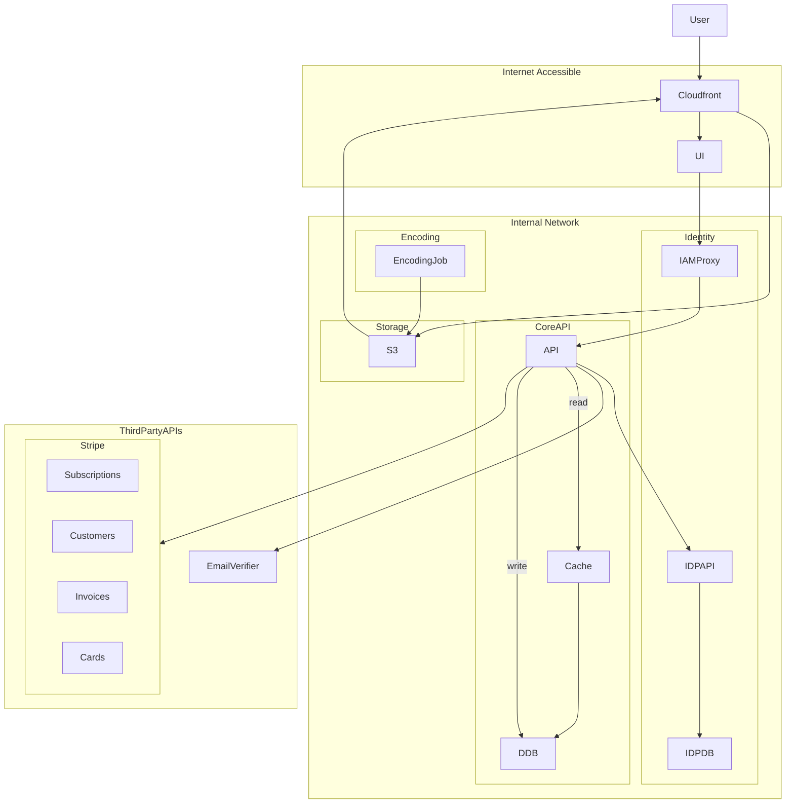

# Crateor Architecture

```mermaid
flowchart TB
    User-->Cloudfront
    UI-->IAMProxy
    IAMProxy-->API
    Cloudfront-->S3
    S3-->Cloudfront
    API-->IDPAPI
    API-->Stripe
    API-->EmailVerifier

    subgraph Internal Network
        subgraph CoreAPI
            API
            API--read-->Cache
            Cache-->DDB
            API--write-->DDB
        end

        subgraph Storage
            S3
        end

        EncodingJob-->S3
        subgraph Encoding
            EncodingJob
        end

        subgraph Identity
            IAMProxy
            IDPAPI-->IDPDB
        end
    end

    subgraph Internet Accessible
        Cloudfront-->UI
    end


    subgraph ThirdPartyAPIs
        subgraph Stripe
            Subscriptions
            Customers
            Invoices
            Cards
        end
        EmailVerifier

    end
```